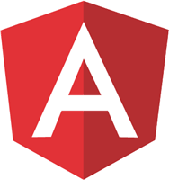
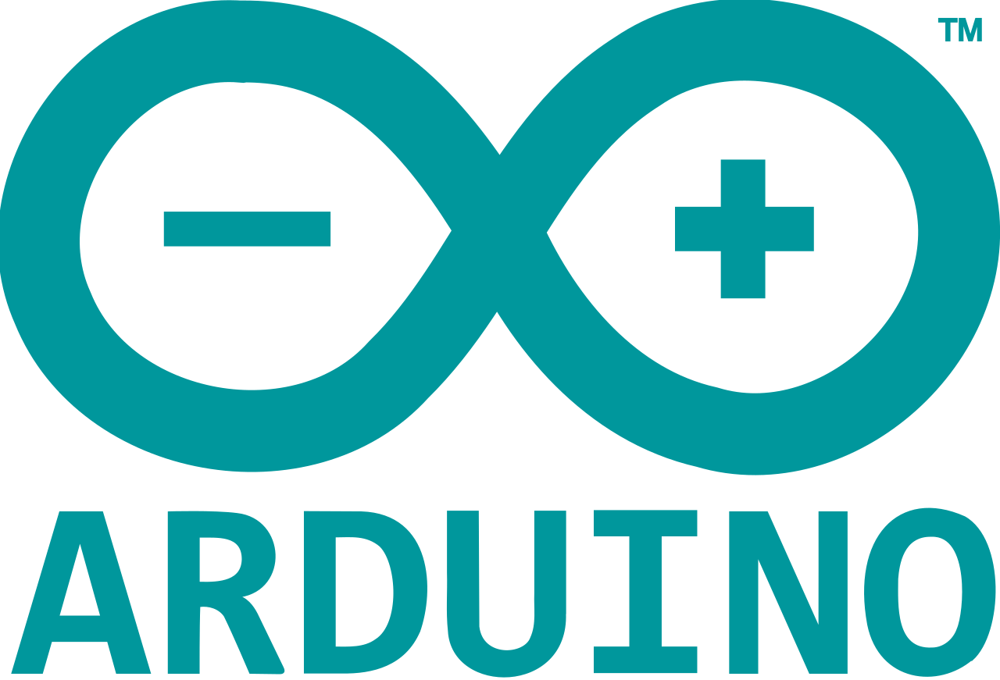

- 👋 Hi, I’m @Robson-Augusto
- 👀 I’m interested in programming and information technologies.
- 🌱 I’m currently work such web programmer at DL company.
- 💞️ I'm looking to learn and aprimorate more languages of programation.
- 📫 How to reach me: e-mail robson.hashi@outlook.com
------------------------------------------------------------
- 💻 I currently use technologies such as:

<a href="https://angular.io/"><td>&nbsp;</td></a>   <td>&nbsp;</td><td>&nbsp;</td><td>&nbsp;</td>

------------------------------------------------------------
- 💻 Visit my professional portifolio in: 
 

 <a href="https://robson-augusto.github.io/portifolio/#home">CLICK HERE</a>
